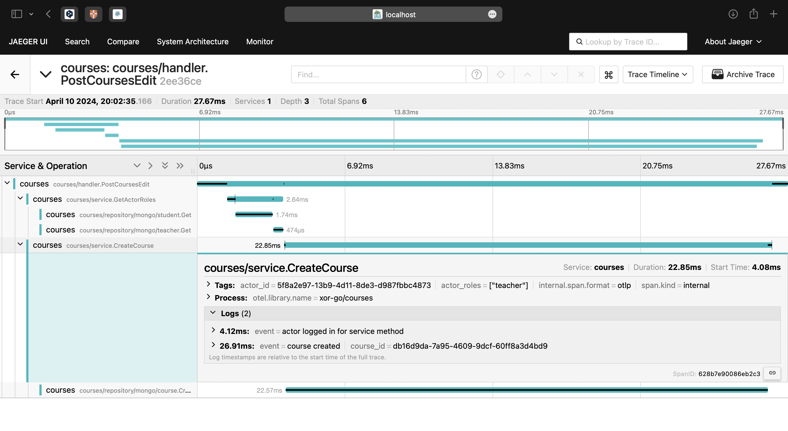
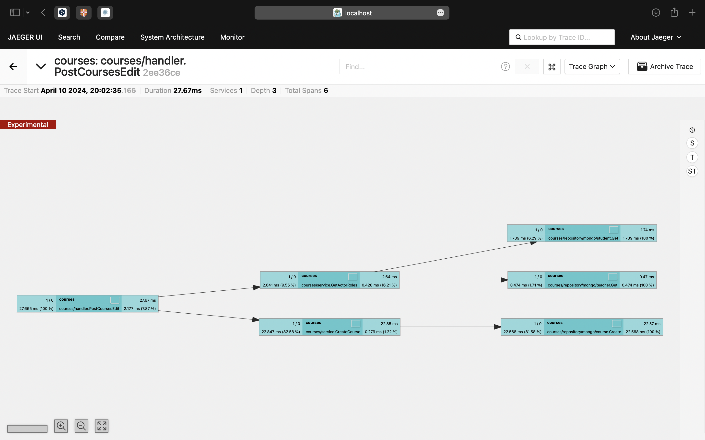
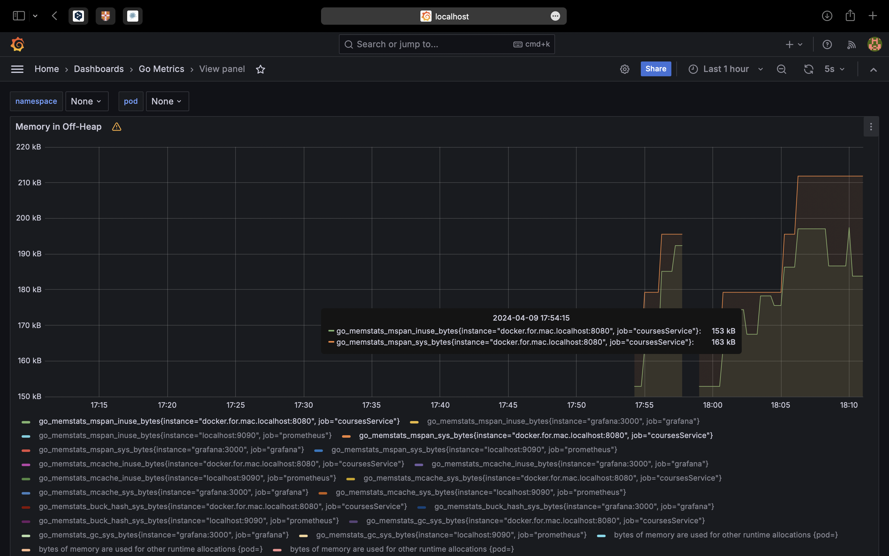
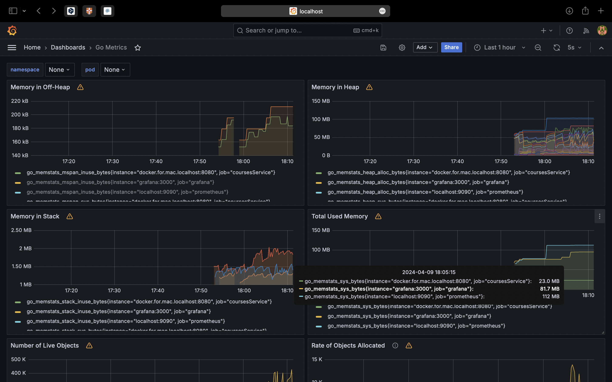
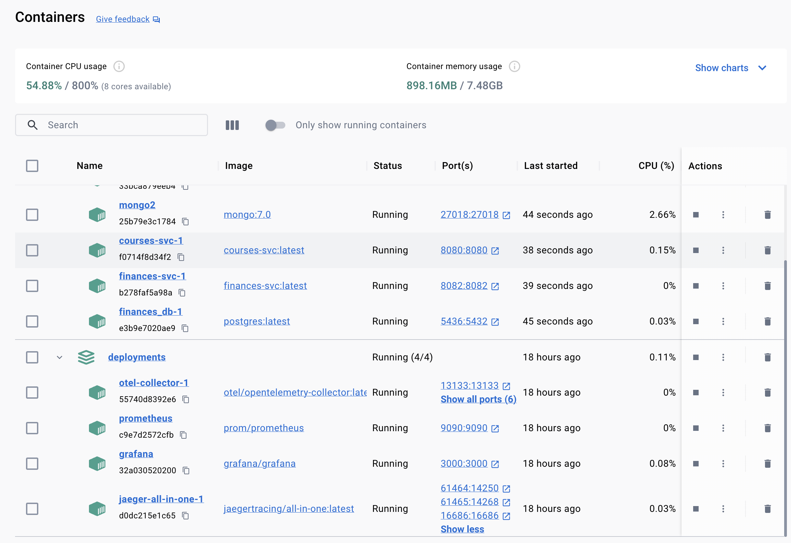

# Courses service
## Киселев Иван

## Общее описание написанного мной сервиса
В проекте сервиса
- Чистая архитектура и
  проработанный по best practice project layout
- Трассировка c использованием Open telemetry и jaeger
- Метрики с Prometheus и Grafana показывающие нагрузку на память и процессоры сервиса
- OpenAPI спецификация API сервиса, тщательно настроенная для генерации клиентов и сервера на Go
- Библиотека для работы с ошибками в REST сервисе, облегчающая дебагинг и скрывающая чувствительные данные от end user
- Настраиваемый логгер, передающийся через контекст, что упрощает тестирование
- MongoDB с автоматической миграцией и репликами, повышающие целевое значение доступности сервиса
- Написанные consumer/producer клиенты Кафки с возможностью легко интегрировать работу с MQ. Возможность подключиться к кафке локально (не из docker)
- Интеграция легковесного демона (daemon) — scraper, с которым можно будет легко запустить фоновую процедуру с бизнес логикой из уже реализованного домена
- Docker compose файлы с проверками доступности программ для инструментов наблюдаемость и сервисов отдельно.
- Docker multistage build методы сборки программы с приятной настройкой

На каждый слой были сделаны свои модели и конвертеры.

Также были использованы другие общие библиотеки вынесенные в pkg
- xshutdown: graceful shutdown библиотека включающая в себя безопасное создание callback’а из любой точки приложение, детальную настройку тайм-аутов, возможность обработки ошибок и force shutdown
-  xconfig: инструмент переписывающий yaml конфиги переменными из env, используя рефлексию

Структура этого сервиса соответствует общему шаблону для сервисов на Go. 

Оформление коммитов выбрано для удобного ручного просмотра и согласно конвенциям

### Документация для клиента к данному сервису:
[API_README.md](./docs/API_README.md)

## Демонстрация работы элементов сервиса

### Трассировки с Jaeger и Open telemetry:
Тут можно видеть контекст запросов. Это нужно для контроля и исправления ошибок в работе одного и множества микросервисов.

Тут можно видеть как работают спаны трассировки. Для каждого такого спана мы можем посмотреть в какой момент времени был вызван метод и сколько времени он занял.

### Grafana и Метрики из Prometheus:
Тут можно видеть нагрузку на процессоры и память сервиса.
Очень важные метрики для контроля нагрузки на сервис и его будущей оптимизации.
Выделение и очистка памяти в Go очень важный критерий для хорошей работы сервиса при высоких RPS.

[//]: # (![prometheus]&#40;.images/grafana_dashboard_2.png&#41;)

### Deployments контейнеры:
Все контейнеры с мониторингом поднимаются и работают независимо от других сервисов.
(здесь также можно видеть реплики mongoDB)

### Описание сборки:
[BUILD_README.md](./docs/BUILD_README.md)

